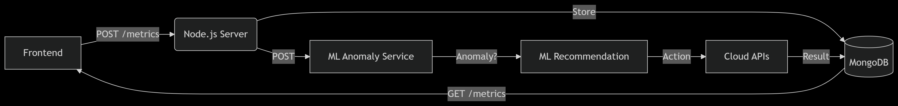
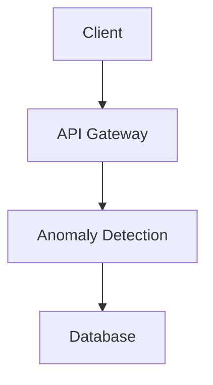
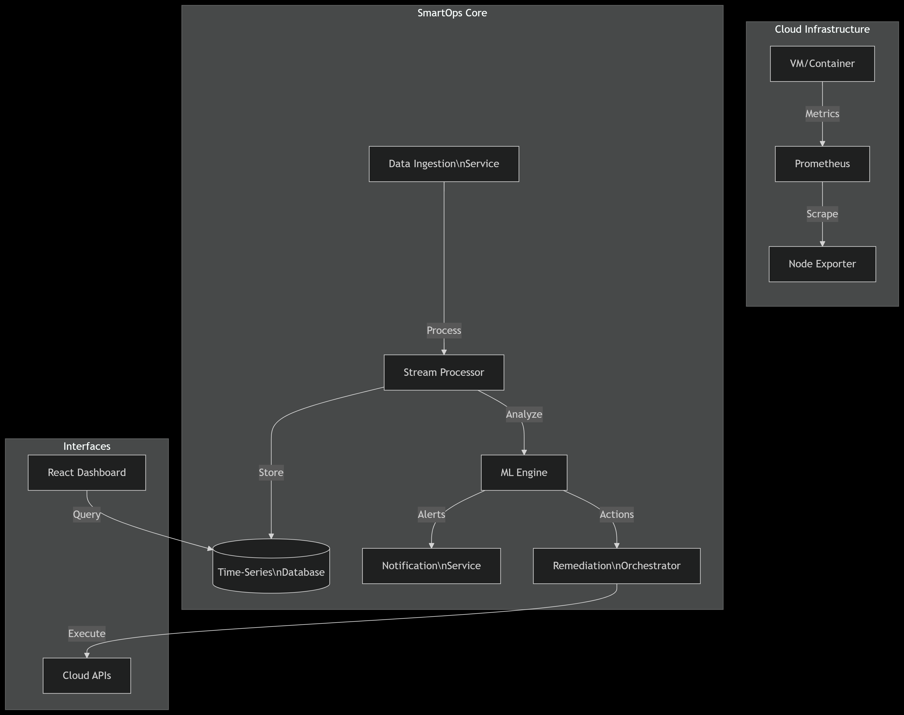

# SmartOps
SmartOps is an AI-driven platform that autonomously monitors, predicts, and optimizes IT infrastructure. Designed for DevOps teams, it integrates real-time metrics, anomaly detection, predictive analytics, and automated remediation to ensure high availability, performance, and scalability across cloud-native environments.
# SmartOps 🤖⚡  
**AI-Powered DevOps Automation Platform**  
*Monitor, Predict, Optimize – Autonomously.*

[](https://opensource.org/licenses/MIT)
[](https://mernstack.com/)
[](https://github.com/features/actions)

  
*Replace with architecture diagram from SRS Section 4.1*

---

## Features ✨  
**Core Capabilities (MVP):**  
- 📊 Real-time infrastructure monitoring (CPU, memory, network)  
- 🚨 Anomaly detection using ML models (TensorFlow/PyTorch)  
- 🤖 Automated remediation workflows (auto-scaling, container restarts)  
- 🔌 Integrations with AWS/Azure/GCP, Kubernetes, Prometheus, Slack  
- 🔒 JWT/OAuth authentication & role-based access control  

**Advanced Phase Features:**  
- 🔮 Predictive resource bottleneck forecasting  
- 🛠️ CI/CD pipeline integration for deployment optimizations  
- 📈 Multi-cloud cost analytics dashboard  

---

## Tech Stack 🛠️  
**Frontend:**  
  
  

**Backend:**  
  
  

**Database:**  
  

**AI/ML:**  
  
  

**DevOps:**  
  
  

---
## Architecture Overview

*Figure 1: SmartOps Data Flow*
  


## System Design

*Figure 2: Architecture Diagram*

  


## Getting Started 🚀  
### Prerequisites  
- Node.js v18+  
- MongoDB Atlas account or local instance  
- Python 3.10+ (for ML components)  
- AWS/Azure/GCP credentials  

### Installation  
```bash
git clone https://github.com/[your-username]/smartops.git
cd smartops

# Install dependencies
npm install --prefix backend
npm install --prefix frontend

# Configure environment variables
cp backend/.env.example backend/.env
cp frontend/.env.example frontend/.env
